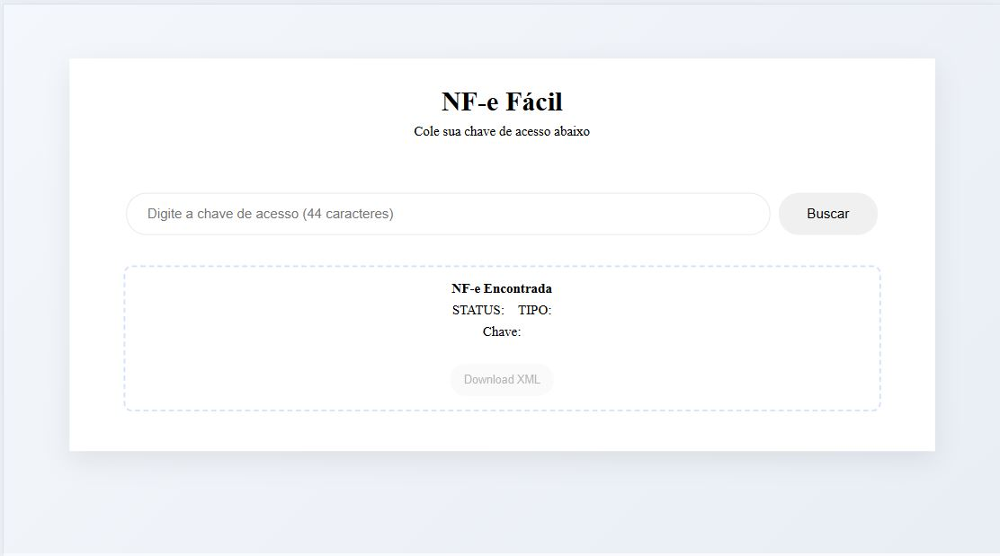

# 🔢 CONSULTA NF-e FACIL

<p align="center">
  Aplicação de calculadora desenvolvida com React, javascript e CSS focada em lógica de programação, manipulação de estados, responsividade e boas práticas de desenvolvimento front-end.
</p>

<p align="center">
  <a href="#-tecnologias">Tecnologias</a>&nbsp;&nbsp;&nbsp;|&nbsp;&nbsp;&nbsp;
  <a href="#-projeto">Projeto</a>&nbsp;&nbsp;&nbsp;|&nbsp;&nbsp;&nbsp;
  <a href="#-funcionalidades">Funcionalidades</a>&nbsp;&nbsp;&nbsp;|&nbsp;&nbsp;&nbsp;
  <a href="#-layout">Layout</a>&nbsp;&nbsp;&nbsp;|&nbsp;&nbsp;&nbsp;
  <a href="https://github.com/Diegogitup?tab=repositories" target="_blank">Portfólio</a>
</p>

---


## 🚀 Tecnologias

Este projeto foi desenvolvido utilizando tecnologias modernas para criação de aplicações web:

- <span style="color:#4ea8de"><strong>HTML5</strong></span> → Estrutura semântica e organização do conteúdo
- <span style="color:#4ea8de"><strong>CSS3</strong></span> → Estilização avançada e responsividade
- <span style="color:#4ea8de"><strong>React.js</strong></span> → Construção da interface baseada em componentes
- <span style="color:#4ea8de"><strong>React Hooks</strong></span> → Gerenciamento de estado com useState
- <span style="color:#4ea8de"><strong>JavaScript ES6+</strong></span> → Lógica da aplicação e manipulação de estados
- <span style="color:#4ea8de"><strong>Node.js</strong></span> → Desenvolvimento do backend
- <span style="color:#4ea8de"><strong>Express.js</strong></span> → Criação da API intermediária
- <span style="color:#4ea8de"><strong>Axios</strong></span> → Comunicação com APIs externas

---

## 💻 Projeto

Este projeto consiste no desenvolvimento de uma aplicação para consulta de Notas Fiscais Eletrônicas (NF-e), utilizando a chave de acesso da nota fiscal.

A aplicação permite consultar uma NF-e de forma rápida e prática, retornando informações da nota fiscal e disponibilizando o download do XML através da integração com uma API externa.

O projeto foi criado com foco em:

- Componentização
- Reutilização de código
- Manipulação de estados
- Organização de lógica
- Integração com APIs
- Experiência do usuário (UX)

---

## ✨ Funcionalidades

✔️ Consulta de NF-e através da chave de acesso

✔️ Validação automática da chave (44 dígitos)

✔️ Integração com API externa

✔️ Exibição das informações da NF-e

✔️ Download do XML da nota fiscal

✔️ Tratamento de erros e validações

✔️ Comunicação entre Frontend e Backend

✔️ Layout responsivo para mobile e desktop

✔️ Interface moderna e intuitiva

---

## ✨ Funcionalidades Técnicas

✔️ Consumo de APIs REST

✔️ Backend intermediário com Express

✔️ Resolução de problemas de CORS

✔️ Manipulação de dados em Base64

✔️ Download dinâmico de arquivos XML

✔️ Componentes reutilizáveis em React

✔️ Organização em Pages, Components e Services

✔️ Estrutura preparada para futuras melhorias

---

## 🎨 Layout

<p align="center">
  🔗 Clique na imagem para visualizar o projeto em funcionamento
</p>

<p align="center">
  <a href="https://diegogitup.github.io/consulta-nfe-facil/" target="_blank">  
    
    
  </a>
</p>

---

## 🧠 Aprendizados

Durante o desenvolvimento deste projeto foram praticados conceitos importantes como:

- Criação de componentes reutilizáveis com React
- Gerenciamento de estado utilizando `useState`
- Manipulação de formulários e eventos
- Requisições assíncronas com `fetch`
- Consumo de APIs REST
- Organização de projeto em componentes, páginas e serviços
- Comunicação entre Frontend e Backend
- Desenvolvimento de API com Node.js e Express
- Tratamento de erros e validações
- Resolução de problemas de CORS utilizando Backend intermediário
- Manipulação de dados em Base64
- Download de arquivos XML e PDF
- Estilização com CSS
- Responsividade utilizando Media Queries
- Estruturação de projetos Frontend e Backend
- Controle de versão com Git
- Hospedagem e versionamento com GitHub

---

## 📁 Estrutura do Projeto

```text
📦 nfe-facil
┣ 📂 backend
┃ ┣ 📄 server.js
┃ ┣ 📄 package.json
┃ ┗ 📄 package-lock.json
┃
┣ 📂 public
┃ ┣ 📄 favicon.svg
┃ ┗ 📄 icons.svg
┃
┣ 📂 src
┃ ┣ 📂 assets
┃ ┃
┃ ┣ 📂 components
┃ ┃ ┣ 📂 InputNfe
┃ ┃ ┃ ┣ 📄 InputNfe.jsx
┃ ┃ ┃ ┗ 📄 InputNfe.css
┃ ┃ ┃
┃ ┃ ┣ 📂 ResultCard
┃ ┃ ┃ ┣ 📄 ResultCard.jsx
┃ ┃ ┃ ┗ 📄 ResultCard.css
┃ ┃ ┃
┃ ┃ ┗ 📂 ResultDisabled
┃ ┃   ┣ 📄 ResultDisabled.jsx
┃ ┃   ┗ 📄 ResultDisabled.css
┃ ┃
┃ ┣ 📂 pages
┃ ┃ ┗ 📂 Home
┃ ┃   ┣ 📄 Home.jsx
┃ ┃   ┗ 📄 Home.css
┃ ┃
┃ ┣ 📂 services
┃ ┃ ┗ 📄 api.js
┃ ┃
┃ ┣ 📄 App.jsx
┃ ┣ 📄 index.css
┃ ┗ 📄 main.jsx
┃
┣ 📄 .gitignore
┣ 📄 eslint.config.js
┣ 📄 index.html
┣ 📄 package.json
┣ 📄 package-lock.json
┣ 📄 vite.config.js
┗ 📄 README.md
```

## ⚡ Como executar o projeto

### 1️⃣ Clonar o repositório

```bash
git clone https://github.com/Diegogitup/consulta-nfe-facil.git
cd consulta-nfe-facil
```

### 2️⃣ Executar o Frontend

```bash
npm install
npm run dev
```

A aplicação ficará disponível em:

```text
http://localhost:5173
```

### 3️⃣ Executar o Backend

```bash
cd backend
npm install
node server.js
```

A API ficará disponível em:

```text
http://localhost:3000
```